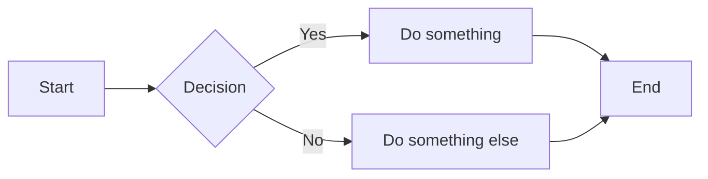
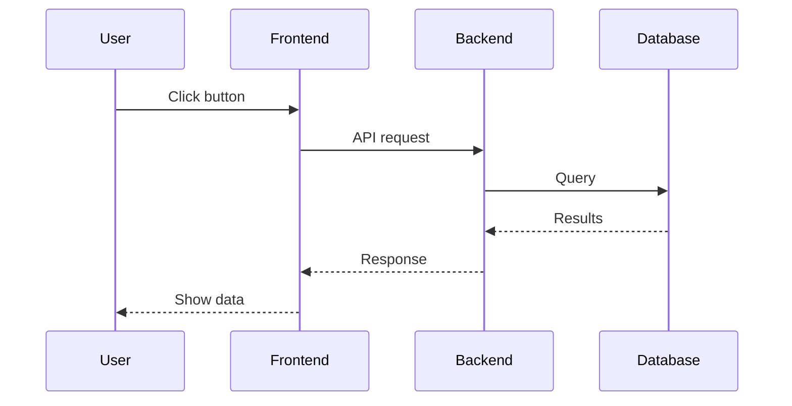

# Markdown Test

## Text Formatting

This is **bold text** and this is *italic text*. You can also do ***bold and italic***.

## Links

Check out [Google](https://google.com) or just paste a URL: https://example.com

## Code

Inline `code` looks like this.

```typescript
function greet(name: string): string {
  return `Hello, ${name}!`;
}
```

## Lists

- Item one
- Item two
  - Nested item
- Item three

1. First
2. Second
3. Third

## Task List

- [x] Completed task
- [ ] Pending task
- [ ] Another pending task

## Blockquote

> This is a quote.
> It can span multiple lines.

## Table

| Name | Role | Score |
|------|------|-------|
| Alice | Admin | 100 |
| Bob | User | 85 |

## Mermaid Diagram



## Another Mermaid Example



## Entity Tokens (Future)

These should render as clickable links once implemented:

- User mention: $$user:abc123
- Project link: $$project:def456
- Ecosystem link: $$ecosystem:ghi789
- Package link: $$package:7894242a-4dde-4c5a-aeee-8bf22dab03c0

Inline usage: Check out $$project:my-project for more details, created by $$user:john-doe.

Edge cases:
- In code: `$$user:should-not-link`
- Multiple on one line: $$user:alice and $$user:bob
- At end of sentence: Created by $$user:charlie.
